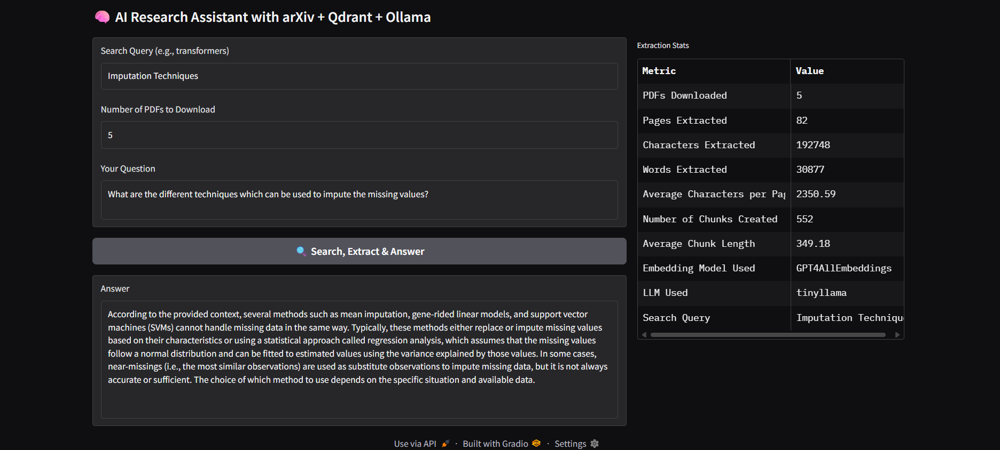
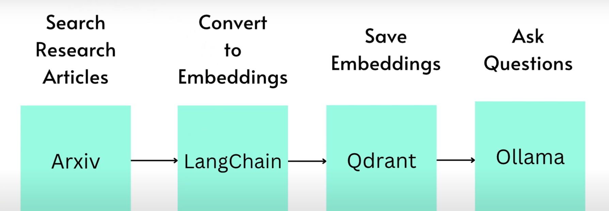

# 🤖 AI Research Assistant with arXiv + Qdrant + Ollama

An intelligent local research assistant built with Gradio, LangChain, Qdrant, and Ollama. This app lets you download arXiv papers, extract and embed their contents, and ask deep research questions—all processed locally using lightweight language models.

---

## 📸 Screenshot

> **Enhanced UI Example**  


---

## 🔄 System Flow

The process flow of this system is as follows:

1. **Search Research Articles on arXiv**  
   - Search arXiv for relevant papers based on the user’s query.
2. **Convert to Embeddings (LangChain)**  
   - Convert the content of the papers to embeddings using the LangChain library.
3. **Save Embeddings to Qdrant**  
   - Store the generated embeddings in a Qdrant vector store for efficient retrieval.
4. **Ask a Question (Ollama)**  
   - Ask a question based on the stored content, and get answers using the Ollama model.

> Here's the visual flow of the system:



---

## ✨ Features

- 🔍 **arXiv Search**: Automatically search and download recent research papers based on a topic.
- 📄 **PDF Extraction**: Extracts and chunks the content of the downloaded PDFs for semantic analysis.
- 🧠 **Vector Store**: Embeds paper content and stores it in Qdrant for efficient retrieval.
- 🤖 **Local LLM QA**: Uses a lightweight Ollama model (`tinyllama`) to answer user questions using contextual information.
- 📊 **Enhanced UI**: Detailed stats on processed papers including pages, words, and chunks.

---

## 🛠️ Installation

### 1. Clone the repository

```bash
git clone https://github.com/your-username/arxiv-research-assistant.git
cd arxiv-research-assistant
````

### 2. Create a virtual environment (optional but recommended)

```bash
python -m venv venv
source venv/bin/activate  # On Windows: venv\Scripts\activate
```

### 3. Install dependencies

```bash
pip install -r requirements.txt
```

Here’s the **updated `README.md` section** that includes clear instructions on how to **pull the `tinyllama` model using Ollama**, along with the already included `ollama run tinyllama` step.

You can add this under the **🛠️ Installation** section, right after installing requirements:

---


### 4. Install and run Ollama

Make sure [Ollama](https://ollama.com) is installed and running on your system.

To download the TinyLLaMA model, run:

```bash
ollama pull tinyllama
````

Then start the model:

```bash
ollama run tinyllama
```

> This app uses `tinyllama`, a lightweight model that runs efficiently on CPUs.


---

## 🚀 Usage

### To run the basic app:

```bash
python app.py
```

A minimal Gradio UI will appear allowing you to:

* Enter an arXiv search query
* Ask a question
* View the model's answer

### To run the enhanced app:

```bash
python enhanced_app.py
```

This version includes:

* Paper download count control
* Progress tracking
* Extraction and chunking statistics
* Improved prompting for richer responses

---

## 📂 Project Structure

```
.
├── app.py                # Basic version
├── enhanced_app.py       # Full-featured version with stats
├── requirements.txt
├── screenshot.png        # UI screenshot (for README)
├── tmp/                  # Temporary vector store (created at runtime)
└── arxiv_papers/         # Downloaded PDFs (created at runtime)
```

---

## 📚 Tech Stack

| Component    | Tool                |
| ------------ | ------------------- |
| Search & PDF | arxiv Python client |
| LLM          | Ollama + tinyllama  |
| Embeddings   | GPT4AllEmbeddings   |
| Vector Store | Qdrant (local mode) |
| UI           | Gradio              |
| NLP Chain    | LangChain + Prompts |

---

## 🧠 Prompting Strategy

Enhanced version uses this template:

```text
You are an expert research assistant. Based only on the following context from research papers, provide a detailed and well-structured answer to the question. Cite relevant insights clearly. You can provide your knowledge which is out of the context when necessary while framing the answer. The final answer should be containing minimum 200 words.

Context:
{context}

Question: {question}
```

---

## 📌 Notes

- Optimized for **local usage** with lightweight LLMs.
- The `arxiv_papers/` and `tmp/` directories are **overwritten after each new query**, so results are not persisted across sessions.
- If you experience connection issues while downloading PDFs, the system will retry automatically.
- Paper content is embedded and stored locally for semantic search.


---

## 📄 License

This project is licensed under the [MIT License](LICENSE).

---

## 🙌 Acknowledgements

* [arXiv API](https://arxiv.org/help/api/)
* [LangChain](https://www.langchain.com/)
* [Qdrant](https://qdrant.tech/)
* [Ollama](https://ollama.com/)
* [Gradio](https://www.gradio.app/)

---

## 🔧 Future Improvements

* Support multiple LLMs from Ollama
* Multi-paper summarization
* Memory-enabled chat history


